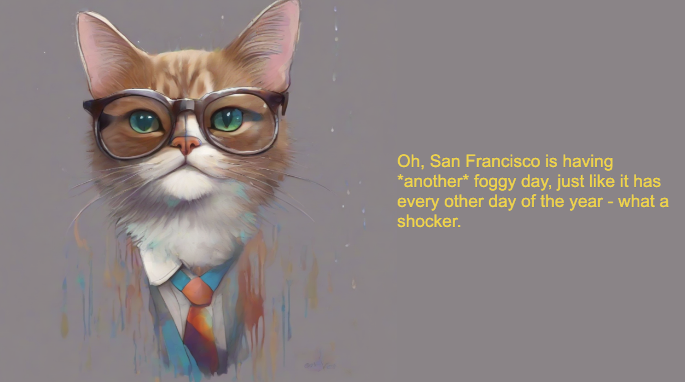

# annie hall weather bot



This repository demonstrates simple llm function calling with Gemini Multimodal Live and parallel [Pipecat](https://github.com/pipecat-ai/pipecat) pipelines. Concept inspired by [the "honest subtitles" scene](https://www.youtube.com/watch?v=JduADWt0XMI&t=56s)\*. Implementation heavily influenced by [simple chatbot](https://github.com/pipecat-ai/pipecat/tree/main/examples/simple-chatbot) and [this](https://github.com/vipyne/weather-bot).

## Quick Start

1. Copy env.example to .env and add API keys
   ```bash
   cp env.example .env
   ```

2. Setup server
   ```bash
   cd server
   python3 -m venv venv
   source venv/bin/activate  # On Windows: venv\Scripts\activate
   pip install -r requirements.txt
   ```

3. Start the server
   ```bash
   python server.py
   ```

4. Setup client
   ```bash
   cd client/javascript
   npm install
   ```

5. Start the client
   ```bash
   npm run dev
   ```

6. Navigate to http://localhost:5173 in your browser and click "Talk to annie hall weather bot".

## Server Overview
   - [README](server/README.md)
   - Pipecat implementation
   - Meat of logic in [annie-hall.py](server/annie-hall.py)

## Client Overview
   - [README](client/javascript/README.md)
   - Basic javascript implementation using [Pipecat JavaScript SDK](https://docs.pipecat.ai/client/js/introduction)
   - No framework dependencies

## Important Note

The bot server must be running for any of the client implementations to work. Start the server first before trying any of the client apps.

## Requirements

- Python 3.10+
- Node.js 16+
- Daily API key (free)
- Gemini API key (free)
- Modern web browser with WebRTC support

\* the content can be problematic, but the concept is solid.
